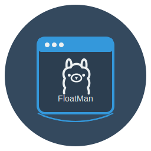
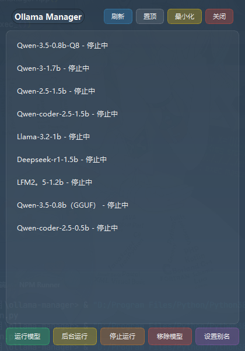

# Ollama FloatMan

Ollama FloatMan 是一个基于 PyQt5 开发的界面工具，用来监控和管理 Ollama 运行的本地模型的状态。

<center>

</center>

## 功能特性

- 📋 **模型管理**：查看本地安装的所有 Ollama 模型
- 🚀 **快速运行**：一键运行或后台运行模型
- ⚙️ **模型控制**：停止运行中的模型
- 🗑️ **模型移除**：轻松移除不需要的模型
- 🔖 **模型别名**：为模型设置自定义别名
- 🖱️ **右键菜单**：便捷的右键操作菜单
- 📊 **状态显示**：实时显示模型运行状态
- 🔄 **手动刷新**：手动刷新模型状态

## 界面预览



## 软件图标


## 系统要求

- Python 3.6+
- PyQt5
- Ollama 已安装并在系统 PATH 中

## 安装步骤

1. **克隆或下载**此项目到本地
2. **安装依赖**：
   ```bash
   pip install PyQt5
   ```
3. **确保 Ollama 已安装**：
   - 从 [Ollama 官方网站](https://ollama.com/) 下载并安装 Ollama
   - 确保 `ollama` 命令可以在终端中正常运行

## 使用方法

1. **启动应用**：
   ```bash
   python main.py
   ```

2. **基本操作**：
   - **运行模型**：选择模型后点击"运行模型"按钮，或右键菜单选择"运行模型"
   - **后台运行**：选择模型后点击"后台运行"按钮，或右键菜单选择"后台运行"
   - **停止模型**：选择运行中的模型后点击"停止运行"按钮，或右键菜单选择"停止运行"
   - **移除模型**：选择模型后点击"移除模型"按钮，或右键菜单选择"移除模型"
   - **设置别名**：选择模型后点击"设置别名"按钮，或右键菜单选择"设置别名"

3. **界面控制**：
   - **最小化**：点击标题栏的"最小化"按钮
   - **刷新状态**：点击标题栏的"刷新"按钮
   - **置顶/取消置顶**：点击标题栏的"置顶"/"取消置顶"按钮

## 技术实现

- **前端**：PyQt5 框架
- **后端**：Python 脚本调用 Ollama CLI
- **状态管理**：实时检测模型运行状态
- **动画效果**：平滑的窗口显示/隐藏动画

## 项目结构

```
ollama-manager/
├── src/                  # 资源文件目录
│   └── demo.png          # 界面预览图片
├── app.py                # 主应用类
├── main.py               # 应用入口
├── ollama_manager.py     # Ollama 管理核心类
├── model_aliases.json    # 模型别名配置文件
└── README.md             # 项目说明文件
```

## 注意事项

- 确保 Ollama 服务正在运行
- 首次运行时，应用会自动检测本地安装的模型
- 模型运行状态会每 5 秒自动刷新一次
- 贴边隐藏功能仅在窗口拖到屏幕底部边缘时生效

## 许可证

本项目采用 MIT 许可证。

## 贡献

欢迎提交 Issue 和 Pull Request 来改进这个项目！